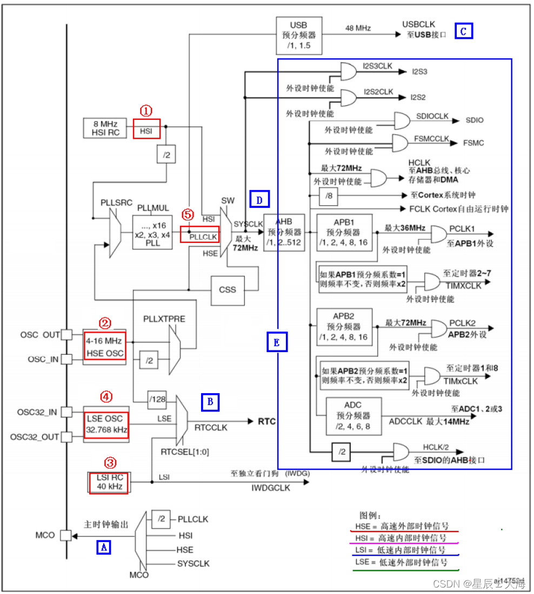
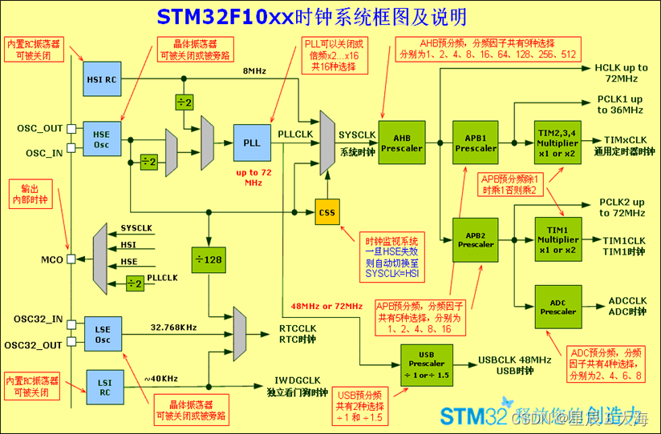

[TOC]
## 一、时钟系统
以下是STM32时钟系统的结构框图，摘自STM32中文参考手册。

可以看到，官方手册提供的时钟框图十分复杂，这是一个简化版的时钟框图：

- HSI是高速内部时钟，RC振荡器，频率为8MHz，精度不高。
- HSE是高速外部时钟，可接石英/陶瓷谐振器，或者接外部时钟源，频率范围为4MHz~16MHz。
- LSI是低速内部时钟，RC振荡器，频率为40kHz，提供低功耗时钟。独立看门狗的时钟源只能是 LSI ，同时LSI 还可以作为 RTC 的时钟源
- LSE是低速外部时钟，接频率为32.768kHz的石英晶体。是主要的RTC时钟源。
- PLL为锁相环倍频输出，Phase Locked Loop其时钟输入源可选择为HSI/2、HSE或者HSE/2。倍频可选择为2~16倍，但是其输出频率最大不得超过72MHz。

> **特别地 ：** 高速外部时钟HSE的引脚是OSC_OUT和OSC_IN这两个引脚芯片是独立引出的，可以接外部的晶振电路，而低速外部时钟LSE的引脚OSC32_IN和OSC32_OUT两个引脚不是独立的，而是在PC14和PC15上，对应关系为OSC32_IN-->PC14 ; OSC32_OUT-->PC15

- 时钟的输出：微控制器允许输出时钟信号到外部MCO引脚。 可以时钟配置寄存器来选择输出的时钟。
- mco:microcontroller clock output 的缩写，是微控制器时钟输
出引脚
- osc   :振荡器（oscillator）是一种能量转换装置——将直流电能转换为具有一定频率的交流电能，其构成的电路叫振荡电路。振荡器主要可以分成两种：谐波振荡器（harmonic oscillator）与弛张振荡器（relaxation oscillator）。

## 二、定时器

